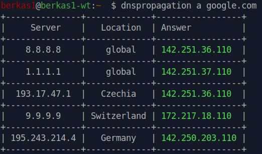
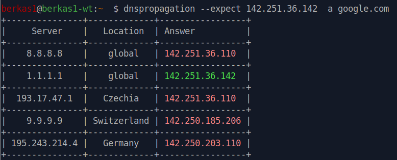

# dnspropagation

CLI utility to check propagation of DNS records using multiple DNS servers simultaneously.

## Installation
```
pip install dnspropagation
# or
pipx install dnspropagation
# or run in docker
docker run berkas1/dnspropagation a google.com
```

## Usage

Specify the record type and domain name:
```
dnspropagation a google.com

# docker
docker run berkas1/dnspropagation a google.com
```

Queries six default public nameservers and prints a formatted table. Use `--json` or `--yaml` for machine-readable output.



## Parameters

### Custom DNS servers

Supply one or more servers with `--server`:
```shell
dnspropagation --server 1.1.1.1 --server 8.8.8.8 a google.com
```

Or provide a YAML-formatted server list via `--custom_list` (see [custom-list.yaml](custom-list.yaml) for the expected format).

### Expected results

Use `--expected` to assert a specific value. Matching values are highlighted green; non-matching values are highlighted red. The flag can be used multiple times.



### Filtering DNS servers

`--tags` and `--owner` filter which servers from the default list or a custom list are queried. Both flags accept multiple values and are combined with AND logic.

### TTL

`--ttl` adds a TTL column to the output table. Works with `--json`, `--yaml`, and `--html` output modes as well.

### Generate HTML output

`--html` writes a self-contained HTML page to STDOUT.

## Other features

- `--no-color` - disable ANSI color codes in terminal output.
- `--timeout <seconds>` - per-query timeout in seconds (float). Defaults to dnspython's built-in timeout.
- `--random <N>` - randomly select N servers from the active server list before querying.
- `--show-default` - print the built-in default DNS server list to STDOUT (add `--yaml` for YAML format).
- `--file <path>` - run multiple record/domain checks defined in a YAML file and output results as JSON.
- `--version` - print the current version and exit.
